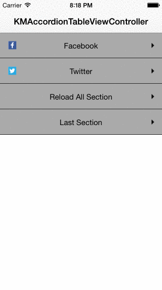

# KMAccordionTableViewController

Accordion UITableViewController component based on Apples's example.

Swift version: https://github.com/klevison/AccordionTableViewController 

<p align="center">
  
</p>

## Current Version

Version: 0.2.1

## Under the Hood

* iOS8 compatible
* StoryBoad compatible
* Supports customization
* Supports UIViews as sections (UIViews, UIViewController's view, UITableViews, UIWebView, MKMapView, etc...)
* Update content and size of a section
* Custom animation

## How to install it?

[CocoaPods](http://cocoapods.org) is the easiest way to install KMAccordionTableViewController. Run ```pod search KMAccordionTableViewController``` to search for the latest version. Then, copy and paste the ```pod``` line to your ```Podfile```. Your podfile should look like:

```
platform :ios, '6.0'
pod 'KMAccordionTableViewController'
```

Finally, install it by running ```pod install```.

If you don't use CocoaPods, import the all files from "Classes" directory to your project.

## How to use it?

### Extends from KMAccordionTableViewController

```objective-c
#import "KMAccordionTableViewController.h"

@interface MyViewController : KMAccordionTableViewController

@end
```

### Implement KMAccordionTableViewControllerDataSource

```objc
- (NSInteger)numberOfSectionsInAccordionTableViewController:(KMAccordionTableViewController *)accordionTableView;

- (KMSection *)accordionTableView:(KMAccordionTableViewController *)accordionTableView sectionForRowAtIndex:(NSInteger)index;

- (CGFloat)accordionTableView:(KMAccordionTableViewController *)accordionTableView heightForSectionAtIndex:(NSInteger)index;

- (UITableViewRowAnimation)accordionTableViewOpenAnimation:(KMAccordionTableViewController *)accordionTableView;

- (UITableViewRowAnimation)accordionTableViewCloseAnimation:(KMAccordionTableViewController *)accordionTableView;
```

### Customization

```objc
@property(nonatomic, assign) NSInteger headerHeight; //Sets section header height.
@property(nonatomic, strong) UIFont *headerFont; //Sets section header font.
@property(nonatomic, strong) UIColor *headerTitleColor; //Sets section header font color.
@property(nonatomic, strong) UIColor *headerColor; //Sets section header background color.
@property(nonatomic, strong) UIColor *headerSeparatorColor; //Sets section header separator color.
@property(nonatomic) UIImage *headerArrowImageOpened; //Sets section header disclosure opened image.
@property(nonatomic) UIImage *headerArrowImageClosed; //Sets section header disclosure closed image.

- (void)setOneSectionAlwaysOpen:(BOOL)isOpen; //set if one section should always be open. if set to YES, the VC will load with the first section already open, and the open section will not close unless you click a different section
```

### Example

```objc
#import "MyViewController.h"

@interface MyViewController () <KMAccordionTableViewControllerDataSource>

@property NSArray *sections;

@end

@implementation MyViewController

- (NSInteger)numberOfSectionsInAccordionTableViewController:(KMAccordionTableViewController *)accordionTableView {
    return [self.sections count];
}

- (KMSection *)accordionTableView:(KMAccordionTableViewController *)accordionTableView sectionForRowAtIndex:(NSInteger)index {
    return self.sections[index];
}

- (CGFloat)accordionTableView:(KMAccordionTableViewController *)accordionTableView heightForSectionAtIndex:(NSInteger)index{
    KMSection *section = self.sections[index];
    return section.view.frame.size.height;
}

- (UITableViewRowAnimation)accordionTableViewOpenAnimation:(KMAccordionTableViewController *)accordionTableView
{
    return UITableViewRowAnimationFade;
}

- (UITableViewRowAnimation)accordionTableViewCloseAnimation:(KMAccordionTableViewController *)accordionTableView
{
    return UITableViewRowAnimationFade;
}

- (void)viewDidLoad {
    [super viewDidLoad];
    [self setupAppearence];
    self.dataSource = self;
    self.sections = [self getSectionArray];
}

- (void)setupAppearence {
    [self setHeaderHeight:38];
    [self setHeaderArrowImageClosed:[UIImage imageNamed:@"carat-open"]];
    [self setHeaderArrowImageOpened:[UIImage imageNamed:@"carat"]];
    [self setHeaderFont:[UIFont fontWithName:@"HelveticaNeue" size:15]];
    [self setHeaderTitleColor:[UIColor greenColor]];
    [self setHeaderSeparatorColor:[UIColor colorWithRed:0.157 green:0.157 blue:0.157 alpha:1]];
    [self setHeaderColor:[UIColor colorWithRed:0.114 green:0.114 blue:0.114 alpha:1]];
    [self setOneSectionAlwaysOpen:NO];
}

- (NSArray *)getSectionArray {
    UIView *viewOfSection1 = [[UIView alloc] initWithFrame:CGRectMake(0, 0, self.view.frame.size.width, 50)];
    KMSection *section1 = [KMSection alloc new];
    section1.view = viewOfSection1;
    section1.title = @"My First Section";

    UIView *viewOfSection2 = [[UIView alloc] initWithFrame:CGRectMake(0, 0, self.view.frame.size.width, 100)];
    KMSection *section2 = [KMSection alloc new];
    section2.view = viewOfSection2;
    section2.title = @"Sec. Section";

    UIView *viewOfSection3 = [[UIView alloc] initWithFrame:CGRectMake(0, 0, self.view.frame.size.width, 700)];
    KMSection *section3 = [KMSection alloc new];
    section3.view = viewOfSection3;
    section3.title = @"thirddddd";

    return @[section1, section2, section3];
}
```

## Contact

If you have any questions comments or suggestions, send me a message. If you find a bug, or want to submit a pull request, let me know.

* klevison@gmail.com
* http://twitter.com/klevison

## Copyright and license

Copyright (c) 2014 Klevison Matias (http://twitter.com/klevison). Code released under [the MIT license](LICENSE).
